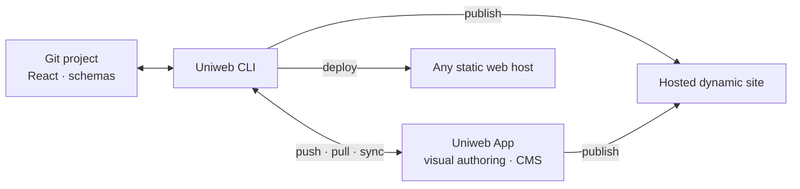

[](https://discord.gg/TkmkA5vH)
[](https://twitter.com/uniwebcms)
[](https://www.npmjs.com/package/uniweb)
[](LICENSE)

# Uniweb


```bash
npx uniweb create
```

## What if visual editing and a normal Git workflow were two interfaces to the same website?

Uniweb is an open-source React framework and a connected visual authoring platform.

Developers build real React components, schemas, and content structures in a normal codebase. Those definitions become the vocabulary authors use to create pages, manage content, and work with structured data.

**Developers define the vocabulary. Authors compose with it. Uniweb keeps both sides in sync.**

**Traditional**

```text
developer builds → hands off → CMS users edit
```

**Uniweb**

```text
developer project ⇄ Uniweb ⇄ author workspace
       ↑                         ↑
       └──── both keep working ──┘
```

---

## Components become an authoring vocabulary

A component can have two interfaces.

For a developer:

```jsx
<Hero />
<FeatureGrid />
<PublicationList />
<Team />
```

For an author, those same components become meaningful building blocks:

| Component | What an author works with |
| --- | --- |
| **Hero** | Heading · Image · Call to action · Layout |
| **Publication List** | Source · Filters · Sorting · Presentation |
| **Team** | People · Roles · Grouping · Style |

The author doesn't manipulate JSX, HTML, or arbitrary layout primitives. The developer doesn't build a separate editing UI for every section of the site.

> **You build the components. Uniweb builds the authoring experience.**

---

## The handoff disappears

Developers and authors can keep working at the same time, in the tools each side prefers.

| Developers | Authors |
| --- | --- |
| React components | Visual components |
| Schemas and configuration | Forms and structured records |
| Vite and local development | Live visual editing |
| Files and Git | Content and composition |
| `push` · `pull` · `sync` | Changes appear live |

The CLI keeps the two environments connected:

| Command | What it does |
| --- | --- |
| `pnpm uniweb push` | Push local components, schemas, and content to the Uniweb App. |
| `pnpm uniweb pull` | Bring authored content back into the local project. |
| `pnpm uniweb sync` | Synchronize the local project and the app. |
| `pnpm uniweb publish` | Synchronize with the app and publish. |

Authors never need to think about synchronization. They work in the visual app, where changes appear live. Developers keep their editor, terminal, Git history, and deployment workflow.



**The CLI is the bridge between the two workflows.**

---

## Define the structure once. Authors get the workspace.

The same idea extends beyond page composition.

A site may need structured content for people, publications, events, courses, products, projects, or something specific to the organization.

Developers define those structures as part of the project. Uniweb presents them to authors as interfaces for creating and managing records.

```js
export default {
  data: {
    people: '@std/person',
    events: '@/schemas/event.json',
    products: '@/schemas/product.json'
  }
}
```

The developer thinks in terms of schemas, relationships, and components. The author sees fields, records, choices, and content.

**No separate admin application is required just to make the data editable.**

---

## Content should outlive the page that first used it

A person isn't fundamentally a block on a department homepage. A publication doesn't belong to whichever website entered it first. Neither does an event, course, project, product, or organization.

Those are entities.

Uniweb can model structured content independently from the pages and components that present it, so the same content can appear in different contexts and across different sites.

> **Content can belong to the organization. Websites become views over it.**

That matters most when many sites need to share the same people, publications, projects, events, courses, or other organizational knowledge without copying it into separate CMS silos.

---

## One content source. Many useful projections.

Once content is independent from presentation, the rendered website is only one possible output.

```text
content
  ├── rendered site
  ├── llms.txt
  ├── route-level Markdown
  ├── search index
  └── localized variants
```

These outputs can be derived from the same underlying content rather than scraped back out of rendered HTML or maintained separately.

Redesign the site and the content remains the same. Add a language and the derived outputs can follow it. Search and agent-readable representations stay aligned with what was actually published.

**Store the content once. Project it into the forms different consumers need.**

---

## AI works better with a vocabulary than a blank canvas

A real website rarely wants an agent inventing arbitrary HTML and CSS every time it makes a change.

It already has components, schemas, design rules, content structures, languages, and conventions.

A Uniweb project gives agents that existing system to work within. An agent can operate in the same file-based environment as a developer: create or modify components, define schemas, work with structured content, and use the CLI.

Once synchronized, those new capabilities become available to authors in the visual app.

> **What should the substrate for AI-created websites be?**

A constrained, semantic component system is one answer worth exploring.

---

## Open source project. Connected authoring platform.

Connecting the Uniweb App doesn't mean moving the project into the app.

| Open-source project | Uniweb App |
| --- | --- |
| React, Vite, files, packages | Visual authoring |
| Git and normal development workflows | Content and composition |
| Components and schemas | Interfaces generated from those definitions |
| Build and deploy with standard web tooling | Live collaboration and managed content |

The framework can be used on its own. When a team needs visual authoring, the CLI connects the same project to the app instead of replacing the developer workflow with a proprietary builder.

```bash
npx uniweb create
```

**The codebase remains the developer environment. The app becomes the author environment.**

---

## Component Content Architecture

These ideas are part of an architectural model we call **Component Content Architecture (CCA)**.

CCA keeps content, components, and composition distinct while making their relationships explicit. That separation is what allows the same content and component system to support code-based development, visual authoring, structured data, multiple sites, derived outputs, and agent workflows without creating separate versions of the website.

The point isn't another CMS abstraction. It is a cleaner boundary between **what the site knows**, **how it can present it**, and **who is working with it**.

---

## Start here

| I want to… | Start here |
| --- | --- |
| **Build with Uniweb** | [uniweb/cli](https://github.com/uniweb/cli) |
| **Learn how Uniweb works** | [uniweb.io](https://uniweb.io) |
| **Use the visual authoring platform** | [uniweb.app](https://uniweb.app) |
| **Browse the framework** | [all Uniweb repositories](https://github.com/uniweb?tab=repositories) |

The **[`uniweb/cli`](https://github.com/uniweb/cli)** repository is the developer entry point.

The full framework spans 20+ focused repositories covering runtime, builds, content architecture, schemas, presentation, developer tooling, and other parts of the ecosystem.

---

## Community

[Website](https://uniweb.io) · [Uniweb App](https://uniweb.app) · [Discord](https://discord.gg/TkmkA5vH) · [X / Twitter](https://twitter.com/uniwebcms)

Uniweb is open source under the **Apache 2.0** license.

<sub>Uniweb is a trademark of Proximify Inc.</sub>
