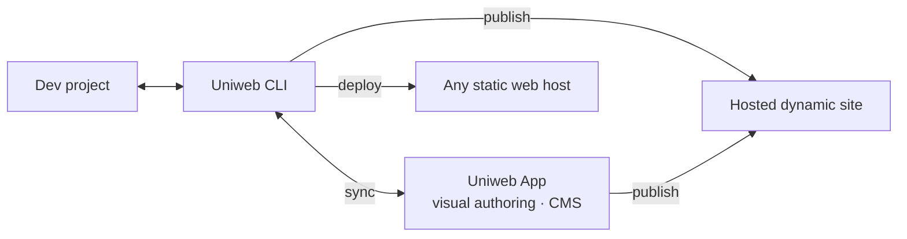

[](https://discord.gg/TkmkA5vH)
[](https://twitter.com/uniwebcms)
[](https://www.npmjs.com/package/uniweb)
[](LICENSE)

# Uniweb

## What if visual editing and a normal Git workflow were two interfaces to the same website?

Uniweb is an open-source React framework and a connected visual authoring platform.

Developers build real React components, schemas, and content structures in a normal codebase. Those definitions become the vocabulary authors use to create pages, manage content, and work with structured data.

**Developers define the vocabulary. Authors compose with it. Uniweb keeps both sides in sync.**

**Traditional**

```text
developer builds → hands off → CMS users edit
```

**Uniweb**

```text
developer project ⇄ Uniweb ⇄ author workspace
       ↑                         ↑
       └──── both keep working ──┘
```

## One system, two working environments

Developers and authors don't need to work in the same tool.

| Developers                 | Authors                      |
| -------------------------- | ---------------------------- |
| React components           | Visual components            |
| Schemas and configuration  | Forms and structured records |
| Vite and local development | Live visual editing          |
| Files and Git              | Content and composition      |
| `push` · `pull` · `sync`   | Changes appear live          |

Uniweb connects those environments without collapsing one into the other.



Developers keep their project, editor, terminal, Git history, and deployment workflow.

Authors get a visual environment built around the system the developers created.

And the two can work at the same time.

---

## Components become an authoring vocabulary

A component can have two interfaces.

For a developer:

```jsx
<Hero />
<FeatureGrid />
<PublicationList />
<Team />
```

For an author, those same components can become meaningful things they can understand and configure:

**Hero**
Heading · Image · Call to action · Layout

**Publication List**
Source · Filters · Sorting · Presentation

**Team**
People · Roles · Grouping · Style

The author doesn't manipulate JSX, HTML, or arbitrary layout primitives.

The developer doesn't build a separate editing UI for every section of the site.

The component system already contains much of the knowledge needed to connect the two.

> **You build the components. Uniweb builds the authoring experience.**

---

## The handoff disappears

Traditional website workflows often have a point where development ends and content management begins.

Uniweb is designed so that boundary can remain live.

Developers can continue evolving components and schemas while authors are already working on the site.

```bash
pnpm uniweb push
```

Push local changes to the Uniweb App. Updated capabilities become available to authors immediately.

```bash
pnpm uniweb pull
```

Bring authored content back into the local project.

```bash
pnpm uniweb sync
```

Keep the two sides synchronized without thinking in terms of a one-way handoff.

```bash
pnpm uniweb publish
```

Publishing also synchronizes the project with the app.

Authors don't need to run these commands. They work in the visual environment, where their changes appear live.

Developers don't need to abandon Git or adopt the visual editor as their development environment.

**The CLI is the bridge between the two workflows.**

---

## Your schema becomes their workspace

The same idea extends beyond page composition.

Suppose a site needs structured content for:

* people
* publications
* events
* courses
* products
* projects

A developer can define the structure as part of the project.

Uniweb can present that structure to authors as an interface for creating and managing records.

The developer thinks in terms of schemas, data relationships, and components.

The author sees fields, records, choices, and content.

No separate admin application has to be built just to make the data editable.

---

## Code and visual authoring don't have to compete

A lot of web tooling implicitly asks teams to choose.

A developer-controlled site gives you React, packages, Git, CI, local development, and architectural freedom — but content editing can become technical.

A visual site builder gives authors an approachable environment — but developers may have to build inside someone else's abstraction.

Uniweb takes a different approach.

The site remains a real software project.

The components remain real React components.

The content remains distinct from presentation.

And when visual authoring is useful, the Uniweb App becomes another interface to the same system rather than a replacement for it.

---

## Open source and hosted authoring are complementary

The Uniweb framework is open source.

You can create a project, develop it locally, keep it in Git, build it, and deploy it using standard web infrastructure.

```bash
npx uniweb create
```

Connecting that project to the Uniweb App doesn't require moving development into a proprietary builder.

Instead, the CLI synchronizes the project with the authoring platform.

That means open source and SaaS don't have to represent competing architectures:

**the open-source project is the developer environment; the app is the author environment.**

Use the framework on its own when that's all you need. Connect it when other people need to work on the site visually.

---

## Content can exist beyond a page

The separation between content and presentation leads to another useful idea.

A person isn't fundamentally a block on a department homepage.

A publication doesn't fundamentally belong to the first website that entered it.

Neither does an event, course, project, product, or organization.

Those are entities.

Uniweb can model structured content independently from the pages and components that present it, allowing the same content to appear in different contexts and across different sites.

For organizations with many websites, this changes the model:

> **Content can belong to the organization. Websites become views over it.**

---

## Component Content Architecture

Uniweb calls the underlying model **Component Content Architecture (CCA)**.

It keeps several concerns distinct:

**Content**
What the site knows and says.

**Components**
How content can be presented and interacted with.

**Composition**
How components and content are assembled into pages and experiences.

**Authoring**
How people interact with those structures without working directly in code.

The relationships between these concerns are explicit rather than hidden in templates or scattered through application code.

That separation is what allows developers and authors to use different interfaces without creating two independent versions of the website.

---

## Built for collaboration with people — and agents

The same architecture becomes interesting when AI enters the workflow.

Most AI website generation starts with a blank canvas:

> Generate some HTML, CSS, and JavaScript.

But an existing site rarely wants arbitrary output.

It has components, schemas, design rules, content structures, languages, and conventions.

A Uniweb project gives an agent a real system to work with.

An agent can operate in the same file-based environment as a developer: create or modify components, define schemas, work with structured content, and use the CLI.

Once those changes are synchronized, authors can immediately use the new capabilities visually.

Instead of asking AI to continually invent websites from scratch, we can ask a different question:

> **What should the substrate for AI-created websites be?**

A constrained, semantic component system is one answer worth exploring.

---

## Why we're building Uniweb

Uniweb sits at the intersection of several larger ideas.

### React & frontend architecture

Why do we build a site's component system and then separately integrate an authoring system?

### Design systems

What happens when a design system becomes not only documentation for developers, but the vocabulary authors actually use?

### CMS architecture

What if the frontend's components and schemas helped define the CMS, instead of a generic CMS defining the shape the frontend has to consume?

### Developer–author collaboration

Why should website development require periodic handoffs when both sides can remain connected throughout the life of the site?

### Structured organizational content

Why should people, publications, projects, events, and other organizational entities be duplicated across independent site databases?

### Multilingual authoring

What does web architecture look like when languages are part of the content system from the beginning rather than a translation layer added afterward?

### AI & web development

What happens when agents create within an existing vocabulary of components, schemas, content, and design constraints instead of generating arbitrary markup?

These questions are a large part of what the Uniweb project is exploring.

---

## Start here

| I want to…                            | Start here                                                            |
| ------------------------------------- | --------------------------------------------------------------------- |
| **Build with Uniweb**                 | [uniweb/cli](https://github.com/uniweb/cli)                           |
| **Learn how Uniweb works**            | [uniweb.io](https://uniweb.io)                                        |
| **Use the visual authoring platform** | [uniweb.app](https://uniweb.app)                                      |
| **Browse the framework**              | [all Uniweb repositories](https://github.com/uniweb?tab=repositories) |

The **[`uniweb/cli`](https://github.com/uniweb/cli)** repository is the developer entry point.

The full framework spans 20+ focused repositories covering the runtime, build system, content architecture, schemas, presentation, developer tooling, and other parts of the ecosystem.

---

## Community

[Website](https://uniweb.io) · [Uniweb App](https://uniweb.app) · [Discord](https://discord.gg/TkmkA5vH) · [X / Twitter](https://twitter.com/uniweb)

Uniweb is open source under the **Apache 2.0** license.

<sub>Uniweb is a trademark of Proximify Inc.</sub>
